# TangleCon Soulbound Token Claim Instructions
#### This readme will explain to you how to qualify for the TangleCon attendee SBT as well as how to display it in your metamask wallet once received

- [Setting up MetaMask](#setting-up-metaMask)
- [Add the ShimmerEVM testnetwork to MetaMask](#add-the-shimmerevm-testnetwork-to-metamask)
    - [The "easy" way](#the-easy-way)
    - [The "secure" way](#the-secure-way)
- [ShimmerEVM wallet address submission](wallet-address-submission)
- [How to display the Soulbound Token in MetaMask](#display-sbt-in-metamask)
- [Display Smart Contract Code on Shimmer testnet EVM Blockexplorer](https://explorer.evm.testnet.shimmer.network/address/0x3868B9e50f383FC37a8635672be6f1e7129b4551/contracts#address-tabs)
- [Smart Contract GitHub Repository](https://github.com/tanglecon/tanglecon-soulbound-smartcontract)
- [Access the ShimmerEVM testnet faucet and get free tokens](https://evm-toolkit.evm.testnet.shimmer.network/)


## Setting up MetaMask
1. Download and install the [MetaMask extension](https://metamask.io/) in your web browser. <br />
2. After installation follow the onboarding/creation process and keep your seedphrase in a secure spot. <br />
3. Congratulations! You have successfully set up your MetaMask wallet and are ready for the next steps! <br />
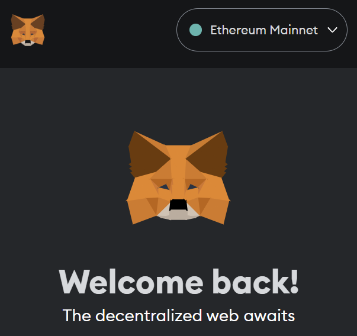 <br />

## Add the ShimmerEVM testnetwork to MetaMask
We have two approaches for this relatively simple task, the fast "trust me" approach, which is essentially a single click (not the best practice security-wise) or the second approach which will take up a bit more of your time (on the flip side you learn a little more about MetaMask) <br />

## The easy way
1. Simply head over to the official [ShimmerEVM testnet explorer](https://explorer.evm.testnet.shimmer.network/) <br />
2. Scroll down to the bottom and click on "Add ShimmerEVM Testnet". <br />
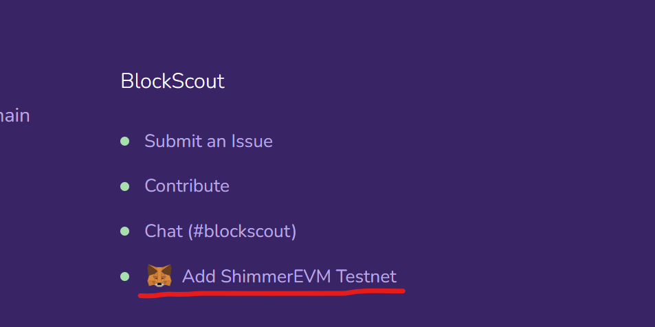 <br />
3. The MetaMask extension should pop up and ask you for confirmation, approve of it and you will be prompted to switch the network as well. <br />
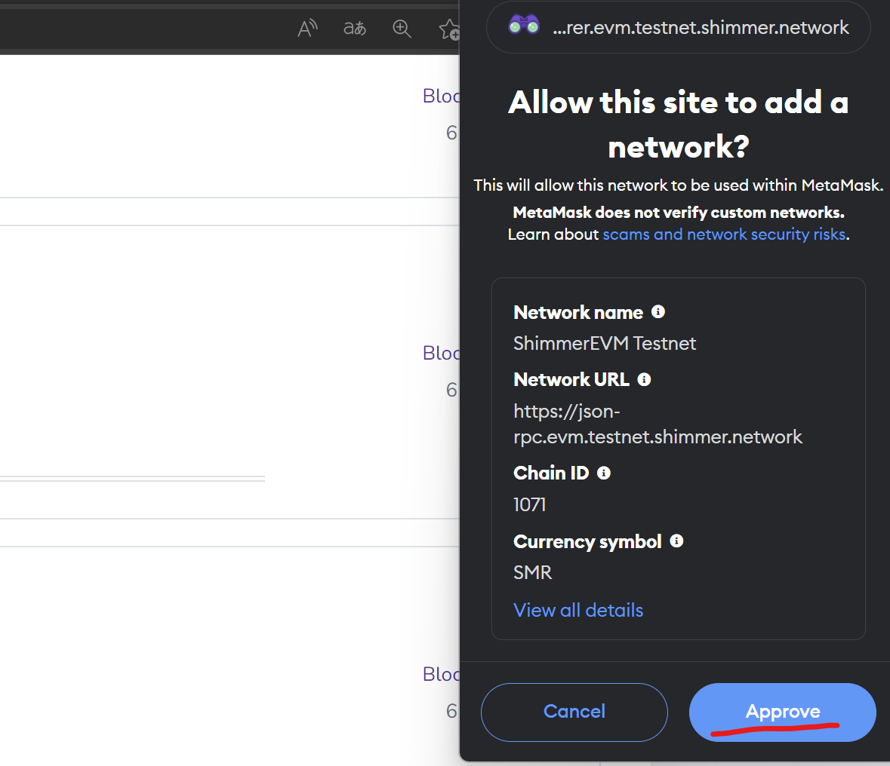 <br />
4. Congrats! You have successfully added the ShimmerEVM testnetwork to your MetaMask! <br />
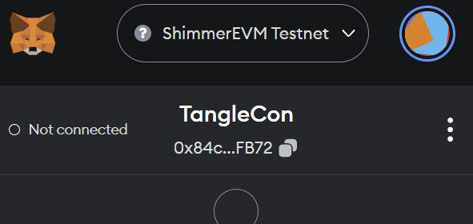 <br />

## The secure way
Of course most people won’t opt in for the previous approach since it is a possible security risk to connect your MetaMask to random websites (even though it is an official website in the previous example), for those cases you add the network manually to their metamask like so: <br />
1. Open up MetaMask, click on your ```Account``` and then on ```Settings``` <br />
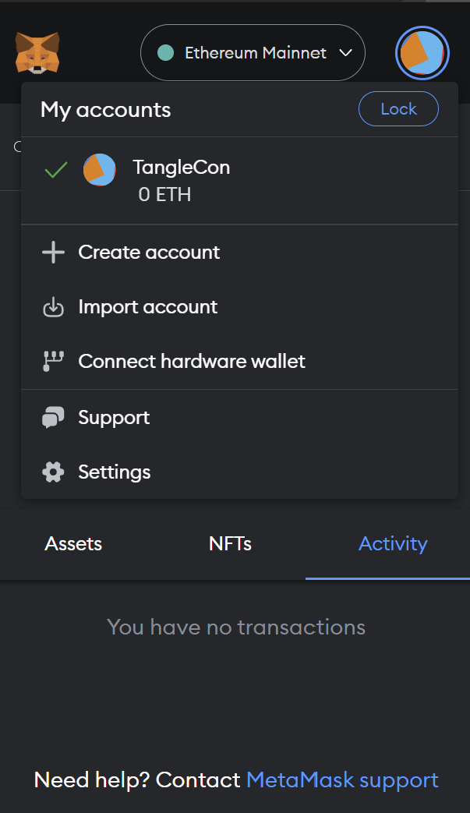 <br />
2. Under ```Security and privacy``` scroll down to the ```network provider``` field and click on ```Add custom Network``` <br />
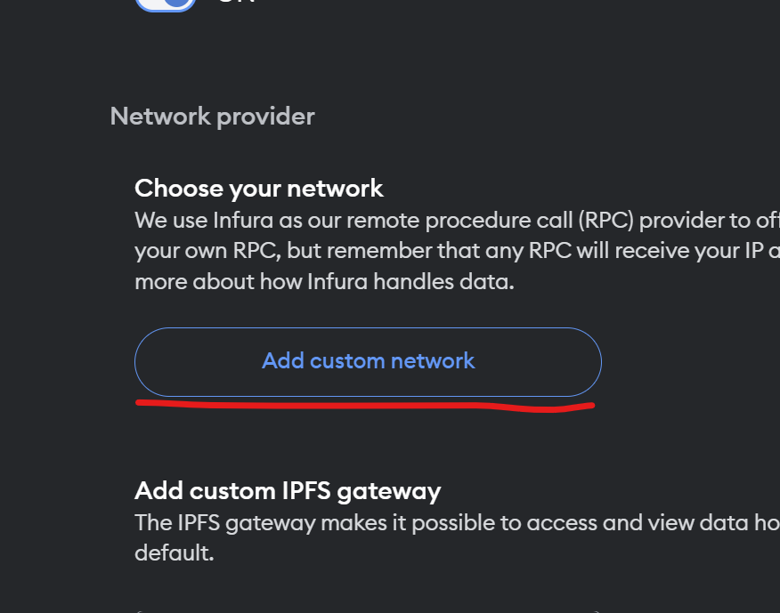 <br />
3. Next click on ```Add a network manually```
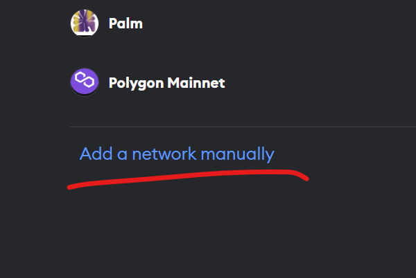 <br />
4. Now fill in the data provided just like in the screenshot and click on ```save``` <br />
[Here is the official IOTA Wiki Article](https://evm-toolkit.evm.testnet.shimmer.network/) <br />
```
# Network Name
ShimmerEVM Testnet

# New RPC URL
https://json-rpc.evm.testnet.shimmer.network

# Chain ID
1071

# Currency symbol
SMR

# Block explorer URL (Optional)
https://explorer.evm.testnet.shimmer.network
```
<br />

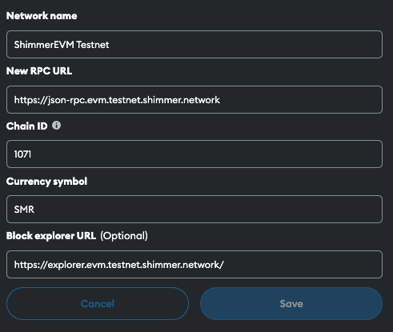 <br />
5. Go back to your MetaMask ```home screen``` and now you can toggle the newly added network  <br />
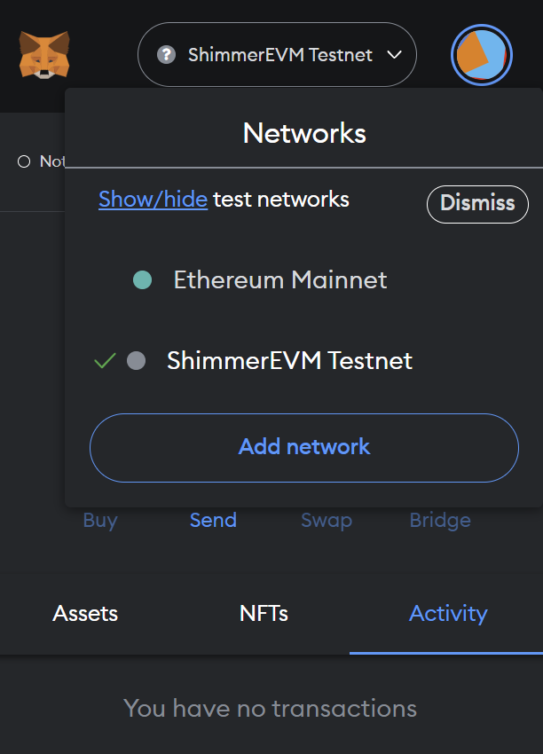 <br />
6. Congrats! You have successfully added the ShimmerEVM testnetwork to your MetaMask! <br />
 <br />

## Wallet address submission
1. Click on your 42-character hexadecimal address and it will be automatically copied <br />
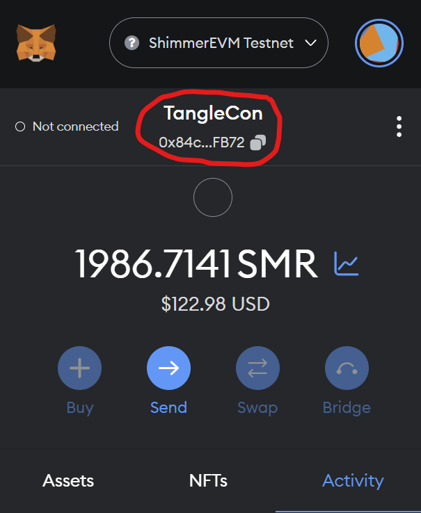 <br />
2. Now paste it into the attendance check poll, if you have been active during the whole 2 days of the event you will receive an Soulbound token as a thank you! <br />

## Display SBT in MetaMask
Now comes the juicy part, we will be syncing the visual representation of the Soulbound token to your MetaMask. (This will only work if you are already holding the SBT in your wallet) <br />

1. Switch to the NFTs tab in your Metamask extension and click on ```Import NFTs``` <br />
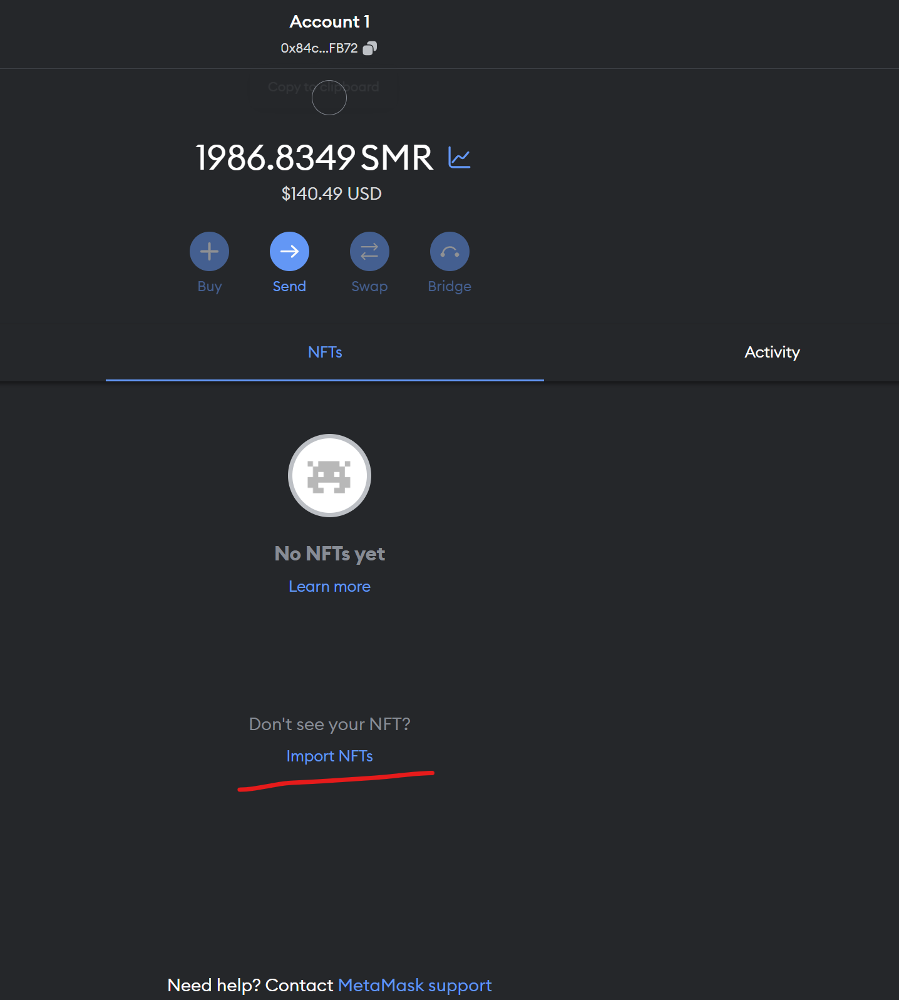 <br />
2. Paste the TangleCon-Awards smart contract address into the address field: ```0x3868B9e50f383FC37a8635672be6f1e7129b4551``` and then the token ID of your token for the TangleCon 2023 it will be ```0``` for ```attendees```, ```1``` for the```project award winner``` and ```2``` for ```speakers```. For demonstration purposes I will now input the token ID 2 into the field and click on "Add". <br />
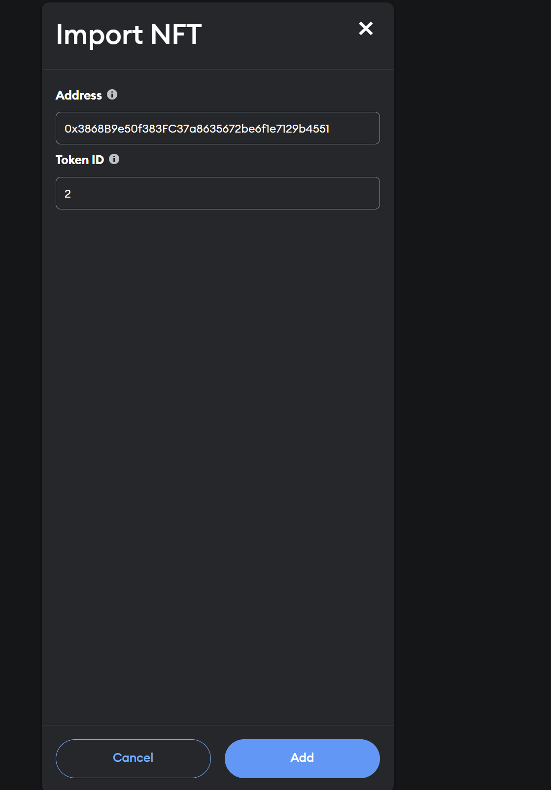 <br />
3. And that’s it. You should be able to see your Token under the NFTs field in your Metamask extension. If you have 2 or more awards, simply repeat steps 1 and 2 with the different token IDs <br />
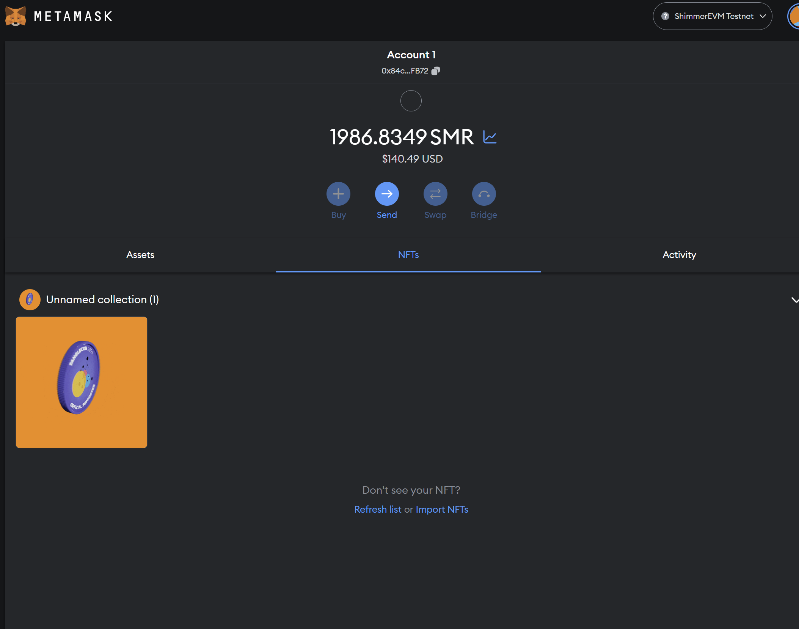 <br />